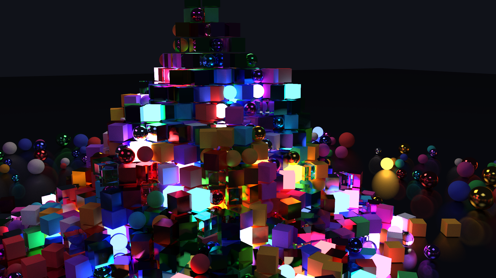
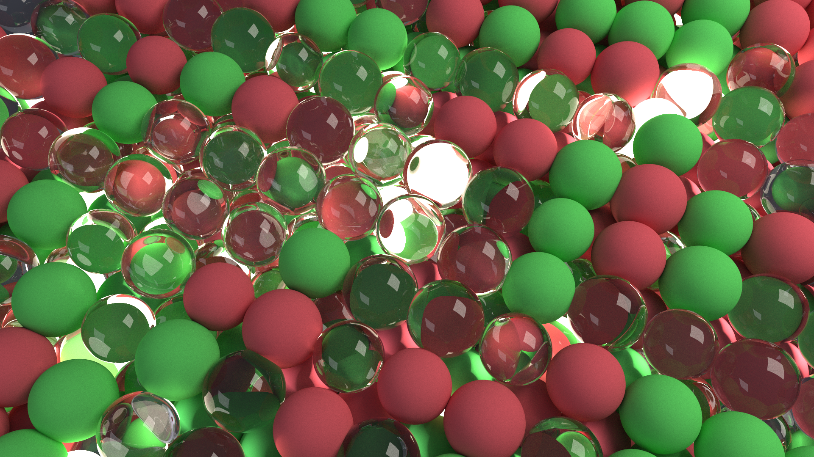
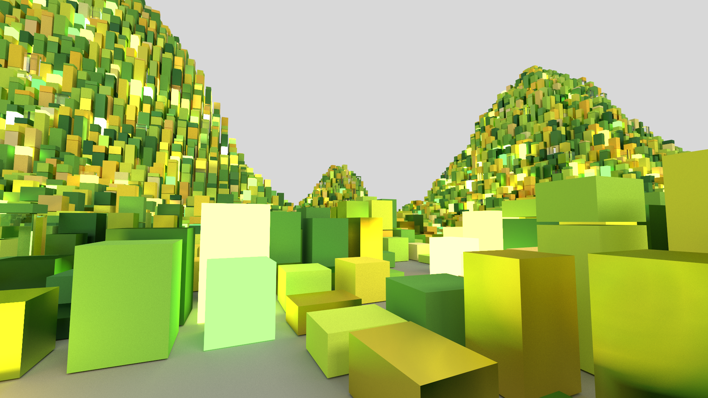
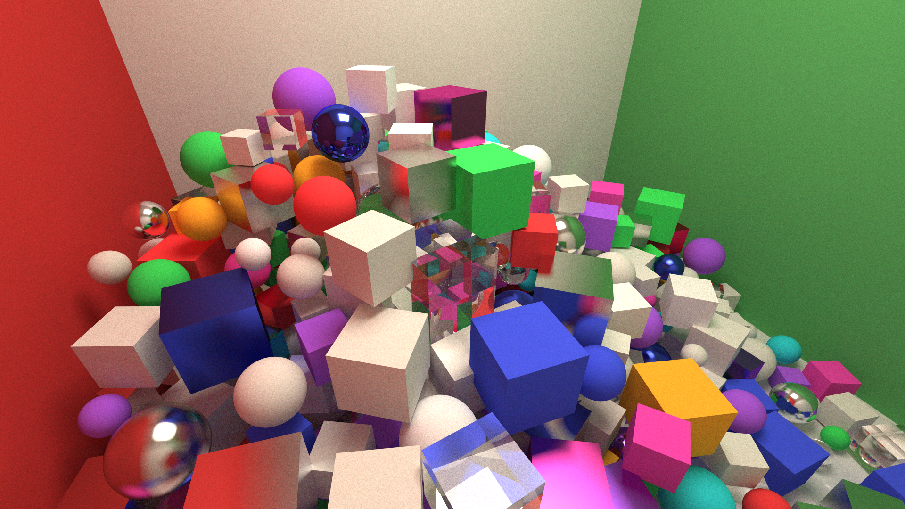
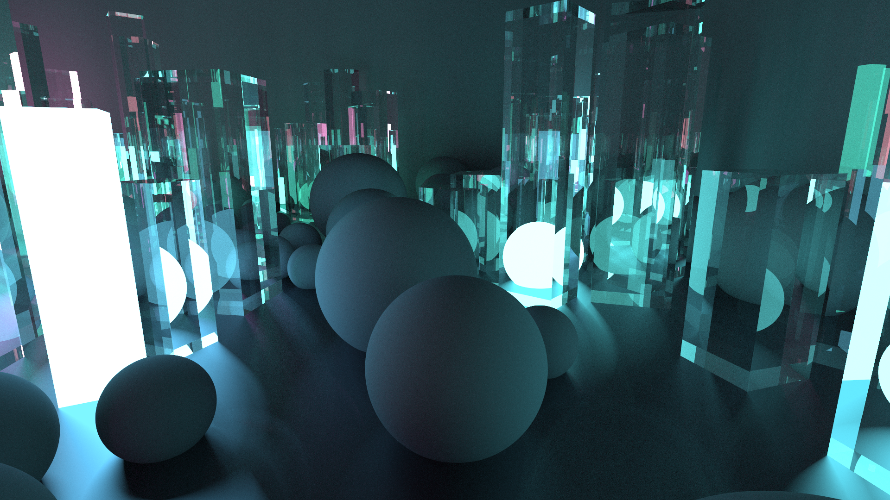
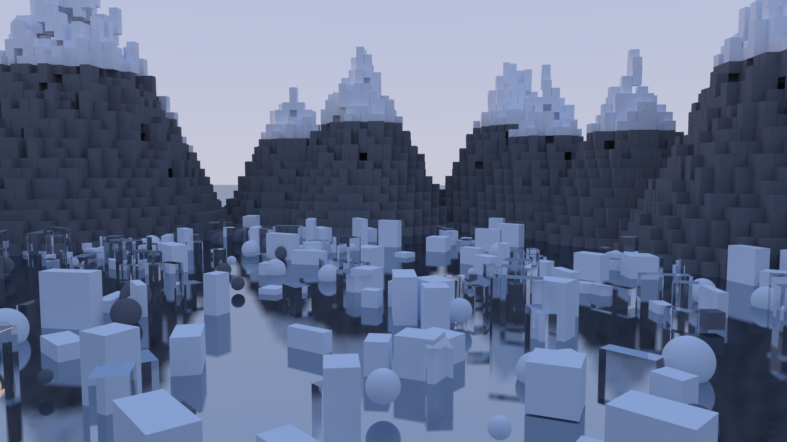

# Hypertracer
A path tracer that runs on the CPU and CUDA. Six scenes, and a real-time viewer you can fly around in while it renders.
Built from scratch with physically based rendering, GPU acceleration, progressive sampling, and multiple procedural scenes. The viewer continuously accumulates samples while you move through the scene, giving you an interactive way to explore the renderer before producing a full-quality render.

## Examples
<div align="center">
  
  
  <br>
  
  
  <br>
  
  

</div>

Everything above was rendered at 1920x1080, 3000 samples, straight out of the
viewer with `R`. Full size versions are in [examples/](examples).

<video src="examples/viewer.mp4" width="99%" controls></video>


## Build

Requires CMake 3.18+, a C++17 compiler, and CUDA for GPU rendering.
Without CUDA, the CPU renderer still works.

```powershell
.\release.ps1
````
The build creates these programs in `build/Release`:
* `hypertracer` - CPU renderer
* `hypertracer_cuda` - GPU renderer
* `hypertracer_view` - scene viewer (Windows)

## Run

```powershell
.\view.ps1                  # Open the viewer
.\render.ps1 3 1920 3000    # Render scene 3
.\cpu.ps1                   # Run the CPU renderer
```

`hypertracer_cuda` takes:
```text
[scene] [width] [samples]
```

It outputs a PPM to stdout and saves a BMP in `output/`.

## Viewer Controls

* `WASD` / Arrow keys - move
* `Q` / `E` - down / up
* Left mouse drag - look around
* `1`-`6` - select scene
* `[` / `]` - previous / next scene
* `Shift` / `Ctrl` - faster / slower
* `P` - save the current view
* `R` - render at full quality
* `F` - reset to the scene camera
* `Esc` - quit

The viewer keeps accumulating samples while you stay still, making the image cleaner over time. When you move, it resets the accumulation and lowers the resolution to keep the camera responsive.

`P` and `R` save images to `output/` with numbered filenames, so existing files are never overwritten.

## References

- Peter Shirley, Trevor David Black, Steve Hollasch,
  [Ray Tracing in One Weekend](https://raytracing.github.io/books/RayTracingInOneWeekend.html),
  [The Next Week](https://raytracing.github.io/books/RayTracingTheNextWeek.html) and
  [The Rest of Your Life](https://raytracing.github.io/books/RayTracingTheRestOfYourLife.html)
- Pharr, Jakob and Humphreys, [Physically Based Rendering](https://pbr-book.org/)
- Moller and Trumbore, Fast Minimum Storage Ray/Triangle Intersection, 1997
- Roger Allen,
  [Accelerated Ray Tracing in One Weekend in CUDA](https://developer.nvidia.com/blog/accelerated-ray-tracing-cuda/)
- [Ray Tracing Gems](https://link.springer.com/book/10.1007/978-1-4842-4427-2)
  vol 1 and [vol 2](https://link.springer.com/book/10.1007/978-1-4842-7185-8),
  free from NVIDIA

## License

MIT, see [LICENSE](LICENSE)
